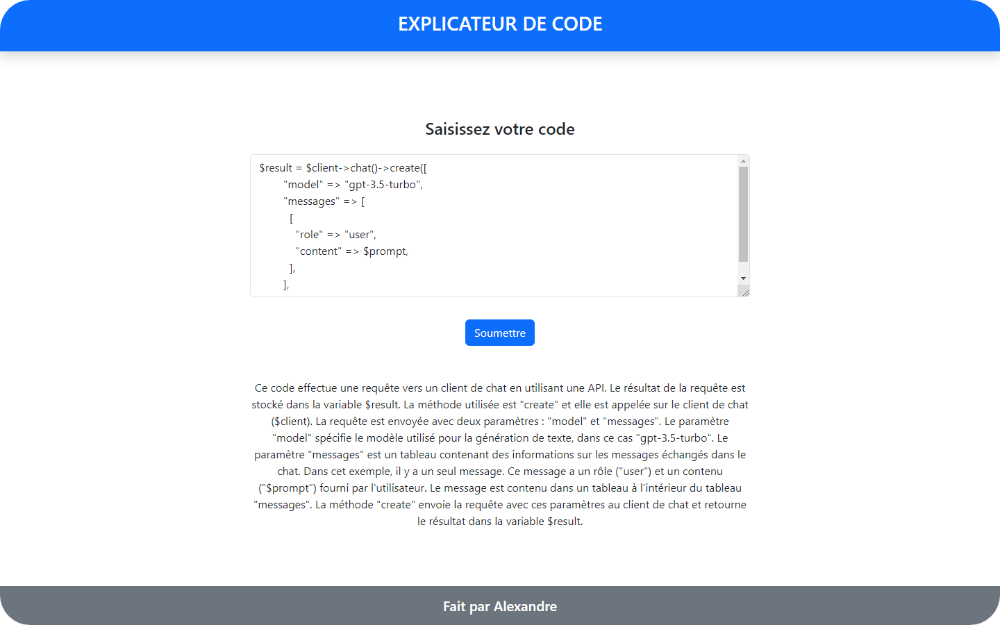

# Chatbot code explainer

A PHP-based chatbot code explainer developed using the OpenAI package.  
The GPT version employed is 3.5, and the chatbot is designed specifically to offer explanations for code.

 

	

 